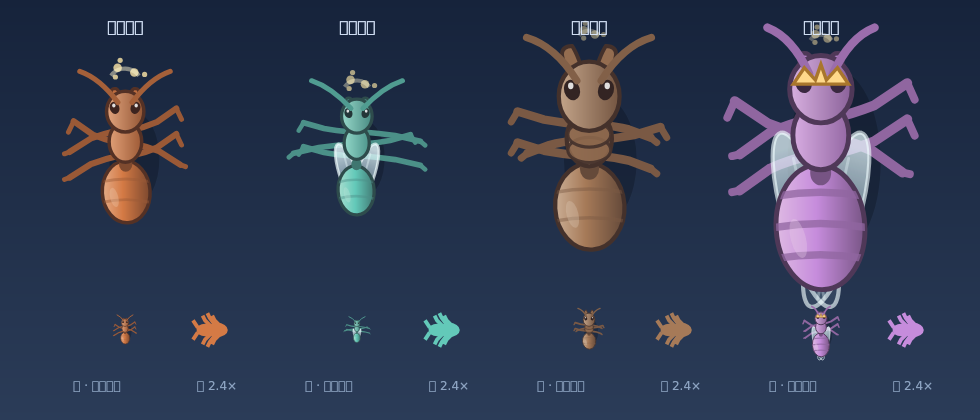
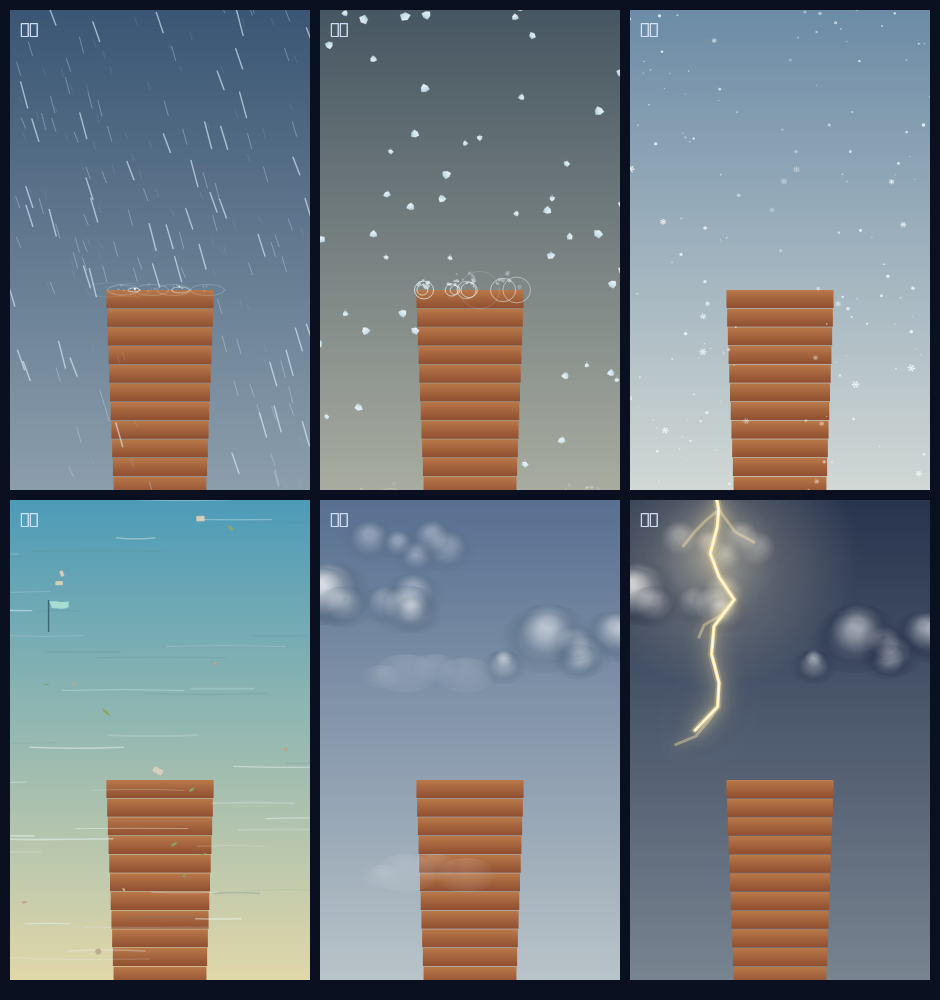
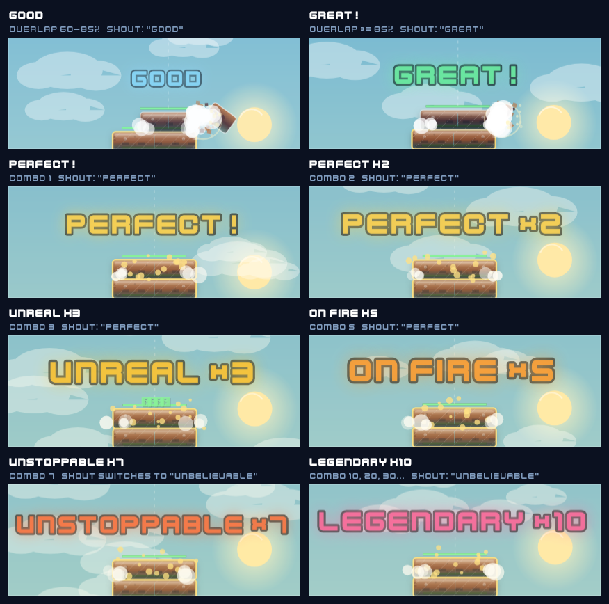
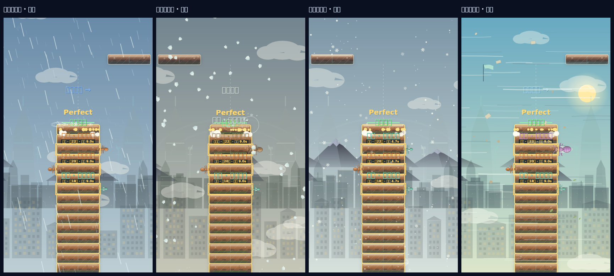
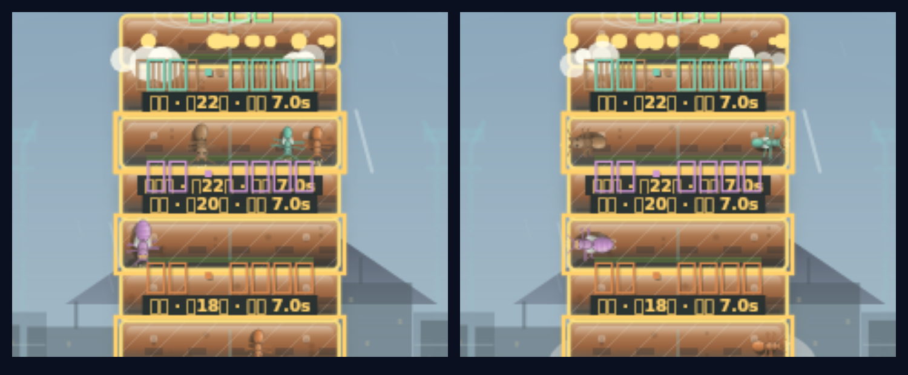
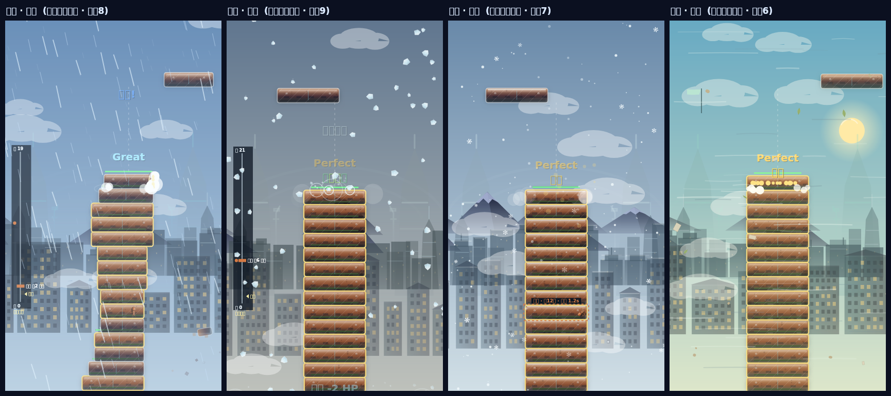
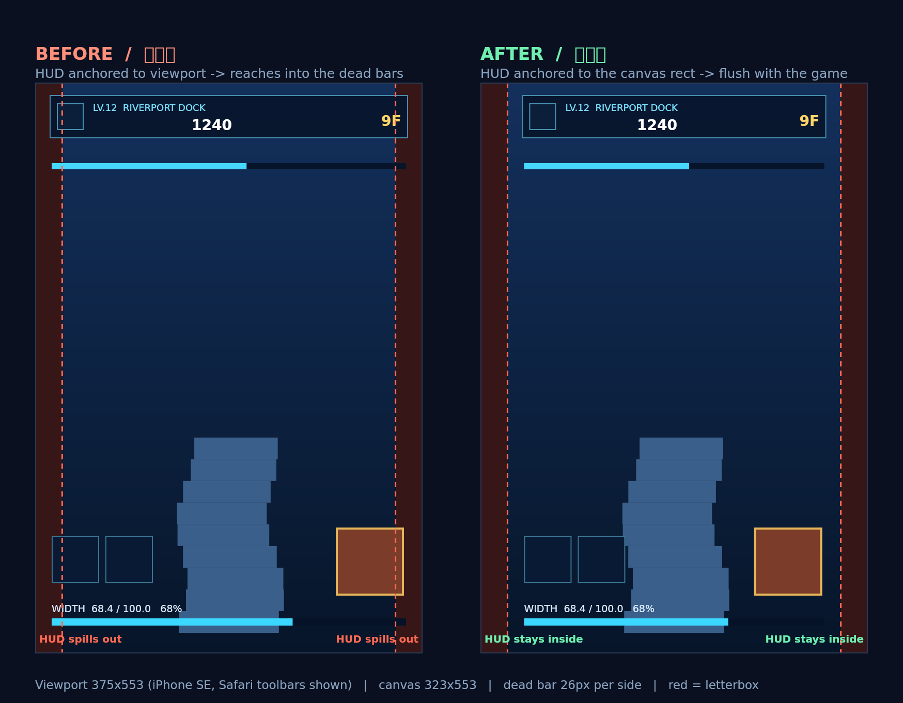
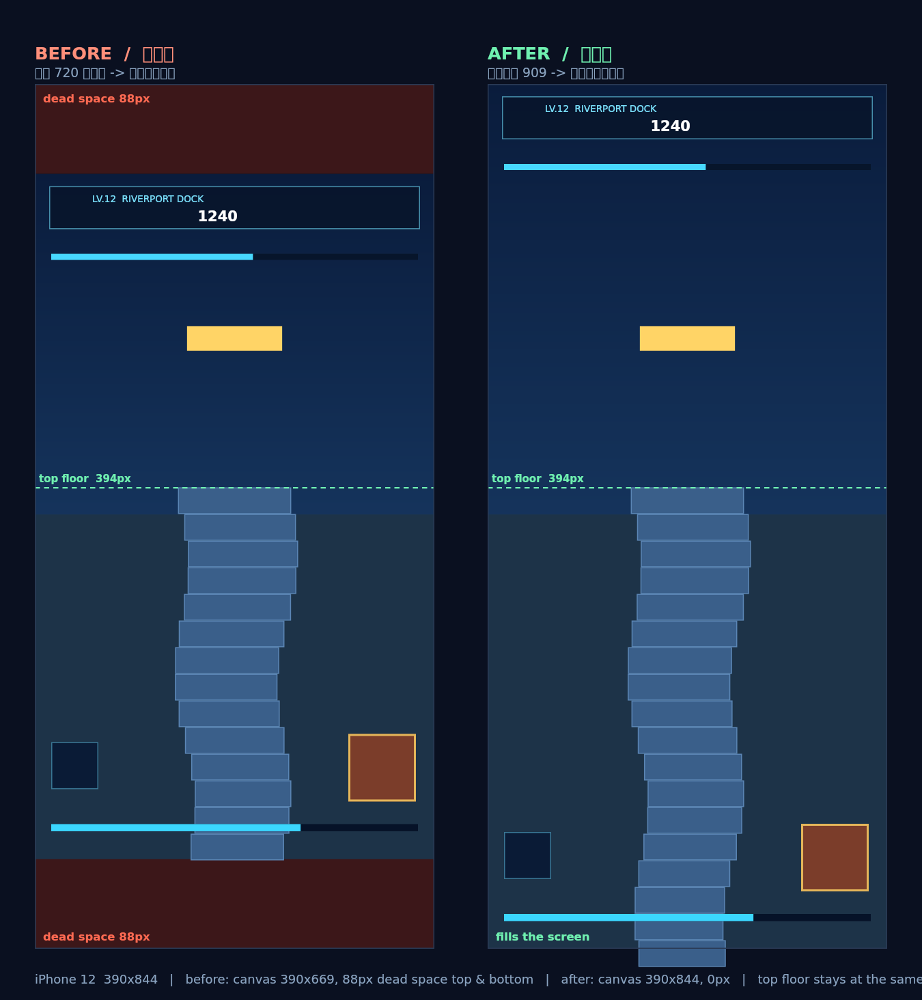

# 敌人 / 天气 / 表现层 — 设计说明

这份文档分两部分：

- **第一部分「当前设计」** —— 代码现在是什么样。想知道某个东西现在怎么运作，看这里。
- **第二部分「过程附录」** —— 八轮改造的时间顺序记录。保留实验数据、被否证的方案和踩过的坑，
  用来回答「当初为什么这么选」「这条路为什么走不通」。

**两边冲突时以第一部分为准**，附录里的描述只对它所在的那一轮负责。

---

# 第一部分 · 当前设计

## 1. 代码地图

| 文件 | 职责 | 行数 |
|---|---|---|
| `src/core/gameEngine.js` | 玩法循环：运动、落层判定、计分、充能、道具、损伤结算 | 1535 |
| `src/core/gameRender.js` | 渲染层：背景 / 天体 / 楼层 / 塔身 / 特效，挂在引擎原型上 | 729 |
| `src/core/geometry.js` | 逻辑画布常量（420×720）与 `clamp` / `lerp` | 18 |
| `src/core/antSystem.js` | 蚁群：出生、寻路、选目标、围攻、咬击结算 | 1159 |
| `src/core/antArt.js` | 蚂蚁造型与步态动画，纯绘制 | 373 |
| `src/core/weather.js` | 天气状态机：阶段推进、强度、对塔的伤害结算 | 1019 |
| `src/core/weatherFx.js` | 六套天气粒子场，纯绘制 | 637 |
| `src/core/audio.js` | 播放引擎：Web Audio 图、调度、淡化、闪避 | 781 |
| `src/core/audioTables.js` | 声音清单：曲目 / 采样表 / 解说 / 材质音 / 电平 | 263 |
| `src/core/scenery.js` | 远景城市与地景 | 1084 |
| `src/components/GameView.vue` | 局内界面：模板 + 逻辑 | 822 |
| `src/components/GameView.css` | 局内界面样式（两层，顺序有意义） | 901 |

分文件的原则是**「谁会来改它」**而不是行数：渲染和玩法是两拨人的事，调音表和音频图是两拨人的事，
样式和交互逻辑是两拨人的事。

## 2. 蚂蚁 — 造型



- **三段式躯体**：腹部（渐变 + 环节纹 + 高光）→ 细腰 → 胸节 → 头（渐变 + 复眼 + 高光）。
- **三角步态**：6 条两段式腿（quadratic + line，末端带抓钩），
  相位 `Math.PI * ((i + side) % 2)` —— 同侧前后腿与对侧中腿同相。
- **四兵种靠几何区分，不只是换色**：

  | 兵种 | scale | 特征 |
  |---|---|---|
  | 工蚁 worker | 1.12 | 基准比例 |
  | 斥候 scout | 1.05 | 长腿、薄翅、步频 13.5（最快） |
  | 钳甲兵 soldier | 1.36 | 巨颚 5.4、胸节背甲 |
  | 蚁后 queen | 1.58 | 带翅 + 头顶金冠 + 3 道腹纹 |

- 配色由 `ANT_SPECIES[].color` 主色经 `lighten` / `darken` 派生，换配色方案不用动渲染代码。
- 局部坐标 **+X = 朝向**，`antSystem._headingAngle(ant)` 负责 translate + rotate。
- 调用：`drawAnt(ctx, { speciesId, color, time, seed, walk, bite, flash })`

**尺寸是硬约束**：`BLOCK_H = 28px`，蚂蚁趴在塔正面，体长必须 ≤ 约 25px，
否则会糊出楼层边界。`_renderTarget` 必须画在 `_renderAnt` 之前，不然目标标记会盖住蚂蚁。

## 3. 蚂蚁 — 威胁模型

蚁群的设计目标：**不是稳定抽税，而是小概率的真实事故**。
实测约 **5% 的局**会发生一次坍塌，整体通关率 **-4.2pt**（p=0.013，336 局配对检验）。

机制由五条组成，缺任意一条都会退化成「完全无威胁」：

1. **围攻**：一轮啃完后若该层已挂彩，蚂蚁原地锁进下一轮，不重挂换层。
   仍付完整 2 秒预备，玩家始终有反制窗口。
2. **突破口**：挂彩最重的楼层成为强吸引子，新蚂蚁直接从它附近进场。
   吸引力必须是**阶跃**（只要挂彩就强吸引），不能按伤口深浅线性缩放。
3. **宽度转耐久**：啃宽度永远不会导致坍塌，一旦把楼层啃窄就转为啃耐久。
4. **坍塌改为下沉**：`sinkFrom()` 只抽掉 3 层、上方塔身整体下沉并重新编号。
   旧的 `collapseFrom` 把上方楼层全剪掉，实测平均一次损失 52.7 层 ≈ 当场结束。
5. **耐久池 ×0.4**（18~46 → 7~18）。**这条是关键**，前四条全做完若不缩池只有 -0.6pt。

**耐久缩减只对蚂蚁生效。** 非蚂蚁来源在 `damageFloor` 里按 `NON_ANT_DURABILITY_SCALE = 0.4`
反向补偿，**冰雹等天气伤害占耐久的比例与改动前完全一致** —— 天气平衡没有被这轮改动波及。

## 4. 天气 — 六套场



| 场 | 内容 |
|---|---|
| `RainField` | 3 层景深（116/104/64 滴）批量 stroke、风切、落在塔顶时溅开、雨幕带 |
| `HailField` | 多面冰块翻滚（5–6 面 + 内部棱线）、拖影、迸裂碎片；`impact(x,y,strength)` 供砸中回调 |
| `SnowField` | far 110 / mid 56 / near 22，近景为六角冰晶；`_laneFade(x)` 淡化中央操作通道 |
| `WindField` | 56 条速度线（亮/暗交替，亮天空下也读得出）+ 20 片落叶纸屑 + 阵风脉冲 + 旗 |
| `CloudField` | 多球径向渐变体积云 |
| `makeBolt / drawBolt` | 带分叉的闪电 + 三遍辉光；`drawSkyGlow` 云层背光 |

**塔顶命中区**由 `_impactRect()` 返回真实塔顶矩形（含 `swayOffset`），
只有真正落在塔顶上的雨雹才溅开。早期写死 `x ∈ (60, 360)` 几乎是整个屏宽，
导致所有雨滴在塔顶高度就被回收、画面下半部整片空掉。

**冰雹的阶段推进对落块是「冻结」而不是「重来」**：落块期间冰雹必须停手（安全规则），
但记住 `suspended` 阶段、不动 `t`、不重置总时长；落块结束只付一次
`HAIL_REARM_SECONDS = 0.6` 的短促再预警。写成「整轮重来」会让倒计时永远走不到 0
—— 这是曾经让砺川章天气活跃度为 **0%** 的 P0。

## 5. 落层评价播报

评价统一收到 `gameEngine._spawnQualityCallout(quality, combo, placed)` **一个出口**，
同时驱动视觉（字号 / 配色）、触觉（屏震 / 闪白）、听觉（语音）三条通道。



| 档位 | 文案 | 字号 | 屏震 | 闪白 | 语音 |
|---|---|---|---|---|---|
| Bad（重叠 < 60%） | `OK` 灰 | 20 | — | — | 无（故意留白） |
| Good（60%~85%） | `GOOD` 青 | 26 | — | — | "Good" |
| Great（≥ 85%） | `GREAT!` 绿 | 32 | 3 | — | "Great" |
| Perfect 连击 1 | `PERFECT!` 金 | 34 | 5 | 0.38 | "Perfect" |
| Perfect 连击 2 | `PERFECT ×2` 金 | 36 | 6 | 0.42 | "Perfect" |
| Perfect 连击 3 | `UNREAL ×3` 琥珀 | 38 | 8 | 0.45 | "Perfect" |
| Perfect 连击 5 | `ON FIRE ×5` 橙 | 40 | 9 | 0.48 | "Perfect" |
| Perfect 连击 7 | `UNSTOPPABLE ×7` 赤橙 | 38 | 10 | 0.52 | **"Unbelievable"** |
| Perfect 连击 10 / 20 / 30… | `LEGENDARY ×N` 品红 | 42 | 11 | 0.55 | "Unbelievable" |

**文字九档，喊话只有四个单词 —— 这个不对称是刻意的。**
眼睛能瞬间读完一行字，耳朵必须等人把话念完。塔每 1~2 秒长一层，
一句 "Five perfect landings! You are on fire!" 要念满 4 秒，念完玩家已经又落了两层。
所以长句全部砍掉，档位感交给文字、字号、配色、屏震、闪白去表达。

语音的两条规则：

- **换档立刻抢断**，不做任何优先级保护。玩家落的是哪一层就该听到哪一层的评价。
  曾经试过「低档位不许打断高档位」，结果是喊话永远慢画面半拍，比叠音更难受。
- **唯一例外 `holdToEnd`**：`unbelievable` 有 2.04 秒，比落层间隔还长，7 连以上会反复触发同一句。
  按抢断规则它每次都把自己掐在开头，听上去像卡带。所以**同一句还在念时重复触发就丢弃本次**，
  换成别的档位（连击断了）仍然立刻抢断。
  「还在念」以元素 `ended` 为准并用实测时长兜底 —— 浏览器拒绝自动播放时 `ended` 永远是 false。

**终局必须掐断喊话**：`_handleFail()`（含弹复活面板那条路）、`_win()`、`_doFail()`、`destroy()`
四条路径开头都调 `Audio.stopVoice()`，静音时 `setEnabled(false)` 也会一并停。

渲染上，评价大字走 `0.35 → 1.18 → 1.0` 的过冲缩放（峰值在生命周期 10% 处），
配 `strokeText` 深色描边 + 同色 `shadowBlur` 辉光。
不同机型 `system-ui` 字宽差异大，`LEGENDARY ×10` 这类长文案会顶出 420px 画布，
所以渲染时先 `measureText` 按 `LOGICAL_W - 24` 等比缩字号再贴边回拉。

**用英文**是因为档位名本来就是代码里的英文枚举，喊话与字幕同语种才对得上。
要改中文需同时换 `QUALITY_CALLOUTS` / `perfectCallout()` 与 `public/assets/voice/*.mp3`。

## 6. 音频

一条血统：**真实录音 / 真实采样**，合成只作兜底。

| 层 | 现状 |
|---|---|
| 菜单音乐 | `menu-pixelate.mp3` |
| 局内音乐 | `battle-vastness.mp3` |
| 音效 | `SFX` 表 29 条目，CC0 采样，去重后预载 68 文件 / 1.59 MB |
| 解说 | 真人录音 4 句 |

**合成轨全部保留为兜底，不要当死代码删掉。** `_startFileMusic` 的 `onerror` 会回落
`_startSynthMusic`，离线或资源缺失时音乐不会消失，`battleIntensity` 三层强度推进也只在那条路径上生效
（文件播放做不了分层，这是接真实配乐的已知代价，已由用户拍板接受）。
同理采样没解码完之前，音效自动回落合成版，不会出现「前几秒没声音」。

`SFX` 表的四个字段：

- `variants` —— 每次在 2~4 个变体里随机挑一个，避免连续触发像机关枪。这是采样相对合成的主要优势。
- `rate` —— 用 `playbackRate` 兼做移调。五种材质靠「不同撞击采样 + 不同 rate」保持辨识度：
  泥土 `impactSoft_heavy`×0.95、混凝土 `impactPlate_heavy`×0.88、钢材 `impactMetal_heavy`、
  青铜 `impactBell_heavy`、乌金 `impactPunch_heavy`×0.8。
  完美落层的金色提示音是「`confirmation` 采样 + 随连击升高的 `playbackRate`」，保留「连击越高越亮」。
- `dur` —— 素材库里的引擎轰鸣长达 5 秒，`flame` 这种每 0.22 秒触发一次的只取开头 0.26 秒，
  尾部指数淡出避免硬切爆音。
- `start` —— **变体编号起点，必填**。`impact` / `scifi` 包从 `_000` 起，`interface` 包从 `_001` 起，
  两套规则并存。写错不会报错，只会静默回落合成版且听感正常，**极难发现**。

采样走 WebAudio（`fetch → decodeAudioData → AudioBuffer` 缓存，播放时建 `BufferSource` 接 `effectsBus`）
而不是 HTMLAudio：与合成音效共用同一条音量链路、不受移动端 Safari 并发元素数限制、能精确截断淡出。

**音量分层**（`audioTables.js`）：

| 常量 | 值 | 说明 |
|---|---|---|
| `MUSIC_FILE_LEVEL` | 0.38 | 文件型曲目 |
| `EFFECTS_LEVEL` | 0.55 | 音效总线 |
| `VOICE_LEVEL` | 0.85 | 解说，不过 `effectsBus`，保证任何时候都能穿透 |
| `VOICE_DUCK` | 0.45 | 解说期间音乐压到的比例 |

解说开口时音乐自动压低、念完抬回（`_duckForVoice`）。
**解说闪避与暂停闪避是两个独立因子相乘**，不是互相覆盖 ——
否则「暂停时解说刚好在念」会让音乐在恢复后停在错误的音量上。
音乐音量只有 `_applyMusicVolume()` 一个出口。

`weatherWind` / `weatherRain` **保持合成**：素材库里没有风雨的持续循环，
而这两者本质上就是滤波白噪声，合成版比硬套一段「太空引擎轰鸣」更像风雨。

## 7. 移动端适配

两个独立问题，两套修法。

**宽度：HUD 锚在视口上，画布锚在自己身上。**
画布按 contain 等比缩放 420×720，临界宽高比 **0.583**。
手机竖屏满屏时约 0.46 看不出问题，但地址栏/工具栏一展开，比例越过 0.583 翻转成「高度受限」，
两侧立刻长出黑边，而 `position: absolute` 贴视口的 HUD 就悬在黑边里 ——
所以这个 bug 是**随工具栏收放忽隐忽现**的。

修法是新增 `.hud-layer`：`resize()` 把画布实际显示矩形写进它的内联样式，
playing 阶段所有 HUD 移入其中，原有的 `left/right/top/bottom` 偏移量一行都不用改，
自动从「相对视口」变成「相对画布」。配套：层内把 `--safe-top/bottom` 重定义为
只取真正侵入画布的那部分（有黑边时黑边已经让开了刘海）；`.hud-layer` 设 `pointer-events: none`
只给按钮容器恢复 `auto`；`.hud-center { min-width: 0 }`（flex 子项默认不肯收缩到内容宽度以下，
关卡名一长就把层数顶出顶栏，这正是「某些东西显示不全」的直接来源）；
`#app` 的 `width: 100vw → 100%`。

**高度：横向仍按宽完整显示 420，纵向不锁死 720。**

```
scale = min(cw/420, ch/720)          // 横向永不裁切，这条不变
viewH = clamp(ch / scale, 720, 1180) // 纵向伸展到刚好填满
```

`viewPad = (viewH - 720) / 2`，`towerTopY` / `groundBaseY` 整体下移 viewPad ——
多出来的高度**一半给天空、一半给塔身**，所以构图与 720 基准完全一致，
实测六种视口下顶层楼在屏幕上的位置一个像素都没动。

两个坑：`setViewHeight` 必须同步平移 `camOffset` / `camTarget`，否则改变视口高度那一帧画面会整体跳一下；
**玩法参数不跟着变**，`antSystem.visibleFloors` 等仍锁 720，否则高屏手机玩家会遇到不同的蚂蚁行为，
属于设备不公平。

## 8. 资源与构建

`public/` 下的东西 Vite 原样全量拷进 `dist`，**仓库里每一个没用到的素材都会发给用户**。

当前 `public/assets` **9.1 MB**，`dist` 9.5 MB，全部 105 个文件都被代码引用（断链 0）：

| 目录 | 内容 |
|---|---|
| `art/` | 6 个 svg（hero-scene / mode-×3 / orbit-bg / player-badge） |
| `kenney_particle-pack/PNG (Transparent)/` | 17 张（flame_01-06、flare_01、smoke_01-03、spark_01-07） |
| `kenney_platformer-art-buildings/Tiles/` | 4 张墙砖与窗 |
| `kenney_simple-space/PNG/Default/` | 4 颗星 |
| `audio/` | 68 个 ogg（impact 33 / scifi 26 / interface 12） |
| `music/` | 2 个 mp3，**6.2 MB —— 现在的体积大头，也是下一个可优化点** |
| `voice/` | 4 个 mp3 |

加素材时注意：**路径里有空格和括号**（`PNG (Transparent)/`），用 curl 之类工具验证存在性时
必须先 URL 编码，否则会返回 `000` 被误判成 404。另外 Vite dev 的 SPA 回退会让任何不存在的静态路径
返回 200 + `text/html`，验证资源存在性必须看 `Content-Type` 或 body 大小，不能只看状态码。

**`lab.html` 是美术检阅台，纯开发工具，不进生产包。**
`npm run dev` 后访问 `/lab.html` 可用；`vite.config.js` 的 `rollupOptions.input` 只有 `index.html`。
可调：天气 7 档 / 强度 / 风向 / 手动触发闪电与冰雹 / 四兵种 / 五状态（climb · windup · bite · stunned · retreat）
/ 放大镜 1–5× / `showOld` 并排旧造型。

## 9. 性能

真实引擎 + 3 只蚂蚁 + 天气 active，`update + render` 全量 JS 耗时：

| 关卡 | ms/帧 | 占 16.7ms 预算 |
|---|---|---|
| 雨汀（雨） | 0.235 | 1.4% |
| 砺川（雹） | 0.394 | 2.4% |
| 雪岑（雪） | 0.323 | 1.9% |
| 岚河（风） | 0.182 | 1.1% |
| 霆川（雷） | 0.214 | 1.3% |

冰雹与云原本每颗粒子每帧都 `createLinearGradient` / `createRadialGradient`；
改为**单位空间绘制 + 每帧建一次渐变、靠 `scale()` 复用**，冰雹从 0.507 → 0.394 ms/帧。

## 10. 测试体系与硬约束

四套回归脚本：`verify.mjs`（玩法总体）、`verify-chapter.mjs`（章节与天气）、
`verify-navigation.mjs`（导航流程）、`verify-gameplay-tweaks.mjs`（本轮改造的契约，54 checks）。

**改渲染时必须满足的三条**（`verify-chapter.mjs` 用 mock ctx 追踪绘制调用）：

1. **云**：`renderFront` 所有 trace 的 `globalAlpha ≤ 0.13` —— 前景云的体积感只能靠形状堆叠。
   注意 mock 的 `save()/restore()` **不保存 `globalAlpha`**，任何一次绘制前都必须已显式设过值
   （`undefined <= 0.13` 为 false 会挂测试）。
2. **雪**：`renderFront` 所有 trace 的 `activeClip === null` —— 禁用 `clip()`，
   所以中央通道淡化靠 `_laneFade(x)` 调 alpha 实现。
3. **雷**：`weather._strike(1)` 之后必须 `flash === 0 && blind === 0` ——
   章节闪电只写 `skyGlow` / `skyGlowAt`，不碰 `flash` / `blind`。

mock ctx 只追踪
`fillRect/strokeRect/moveTo/lineTo/quadraticCurveTo/bezierCurveTo/arc/ellipse/closePath/fill/stroke`。
**改用 `Path2D` / `drawImage` / 离屏 canvas 会让上述断言静默失效。**

**不可改的数值契约**：`WARNING_SECONDS = 1.2`（`verify-gameplay-tweaks.mjs:81` 断言
`warningRemaining === 2`）、`maxAlive = 5`、`maxTargetsPerFloor = 3`、`spawnGapSeconds = 4.5`、
单层 2 秒内伤害 ≤ `maxFloorBurstDamage`(6)、`queen.hp = 12`。

**做平衡实验时**：主指标必须是**通关率**而不是平均层数（游戏达到 `target` 就判 win，
层数被目标值钉死，蚂蚁再强也压不下来），且必须在玩家会输的水平线（±14px）上测；
必须替换全局 `Math.random` 并加「同参数两次结果全等」自检，
否则引擎自身的随机（`startLeft` / `unityChance` / `goldenBellChance`）会淹没信号；
自动玩家必须先用 tol=0 验证能 100% 通关且顶宽不掉，再拿去跑实验。

## 11. 已知取舍与未竟事项

- **局内配乐做不了强度分层**：换成文件播放的代价，已拍板接受。合成兜底路径上仍然生效。
- **两首 BGM 共 6.2 MB**，占 `dist` 的三分之二。转码成更低码率或更短的循环段是下一个优化点。
- **`weatherWind` / `weatherRain` 仍是合成**，等补进真实环境音循环再换。
- **`GameView.css` 的两层样式没有合并**：第二层是美术改版追加的覆盖层，靠 `!important` 压第一层。
  合并有视觉风险，目前只做了搬运并在文件里写明顺序不能调换。
- **PR 混合了六类关注点**（美术 / 玩法修复 / 移动端 / 敌人平衡 / 音频 / 整洁度），
  按分支策略无法拆分，改为在 PR 描述里按关注点分组说明。

---

# 第二部分 · 过程附录

按时间顺序记录八轮改造。保留的是**实验数据、被否证的方案和踩过的坑** ——
结论本身以第一部分为准，这里回答的是「为什么是这样」。

标着 `> 已过时` / `> 已被…推翻` 的地方说明该段描述只对它所在那一轮有效。

---

## 第一轮 · 敌人 / 天气的美术重做

承接 `docs/ENEMY_WEATHER_AUDIT.md` 的审计结论，本轮**只动渲染，不动玩法数值**。
所有机制、伤害、时序、关卡配置均未改动，4 套回归脚本全绿。

### 1. 蚂蚁 `src/core/antArt.js`（新增）

#### 改造前的问题（审计原文）
两个椭圆合并在同一个 `beginPath() + fill()` 里 → 没有细腰、只有 2 节、约 16×6px；
6 条折线腿**完全静态**；单色平涂；**四个兵种几何完全相同，只换颜色**；咬击是一个脉动圆圈。

#### 现在


每行左侧为新造型（5.2× 放大）与实际游戏尺寸，右侧为旧造型（2.4× 放大）作对照。

- **三段式躯体**：腹部（渐变 + 环节纹 + 高光）→ 细腰 → 胸节 → 头（渐变 + 复眼 + 高光）。
- **步态动画**：6 条两段式腿（quadratic + line，末端带抓钩），
  按 `Math.PI * ((i + side) % 2)` 做相位偏移实现**三角步态**——同侧前后腿与对侧中腿同相。
- **兵种差异化**（不再只是换色）：

  | 兵种 | scale | 特征 |
  |---|---|---|
  | 工蚁 worker | 1.12 | 基准比例 |
  | 斥候 scout | 1.05 | 长腿、薄翅、步频 13.5（最快） |
  | 钳甲兵 soldier | 1.36 | 巨颚 5.4、胸节背甲 |
  | 蚁后 queen | 1.58 | 带翅 + 头顶金冠 + 3 道腹纹 |

- **配色**由 `ANT_SPECIES[].color` 主色经 `lighten/darken` 派生，换色方案不用改渲染代码。
- **咬击**改为贴着上颚尖端迸出的碎屑 + 短弧，不再是圆圈。
- 局部坐标 **+X = 朝向**，`antSystem._headingAngle(ant)` 负责 translate + rotate。

调用：`drawAnt(ctx, { speciesId, color, time, seed, walk, bite, flash })`

### 2. 天气 `src/core/weatherFx.js`（新增）

#### 改造前的问题（审计原文）
雪花**只有 14 片**；雾带 5 个椭圆；雨是 1.4px 直线、无飞溅；冰雹是白圆点、不旋转；
风在**空中没有任何动态元素**，只有固定在 (62,180) 的静态旗；雷是单条无分叉折线。

#### 现在


| 场 | 内容 |
|---|---|
| `RainField` | 3 层景深（116/104/64 滴）批量 stroke、风切、**落在塔顶时溅开**、雨幕带 |
| `HailField` | 多面冰块翻滚（5–6 面 + 内部棱线）、拖影、迸裂碎片；`impact(x,y,strength)` 供砸中回调 |
| `SnowField` | far 110 / mid 56 / near 22，近景为六角冰晶；`_laneFade(x)` 淡化中央操作通道 |
| `WindField` | 56 条速度线（亮/暗交替，亮天空下也读得出）+ 20 片落叶纸屑 + 阵风脉冲 + 旗 |
| `CloudField` | 多球径向渐变体积云 |
| `makeBolt / drawBolt` | 带分叉的闪电 + 三遍辉光；`drawSkyGlow` 云层背光 |

#### 塔顶命中区
原先雨雹的溅射判定写死 `x ∈ (60, 360)`，几乎是整个屏宽 ——
结果所有雨滴都在塔顶高度被回收，**画面下半部分整片空掉**。
现改为 `_impactRect()` 返回真实塔顶矩形（含 `swayOffset`），只有真正落在塔顶上的才溅开。

### 3. 美术检阅台 `lab.html`

`npm run dev` 后访问 **`/lab.html`**。Vite 已配置为第二入口（`vite.config.js` 的 `rollupOptions.input`）。

> **已过时（第八轮）**：lab 已移出 `rollupOptions.input`，不再进生产包。dev 下访问方式不变。

可调：天气 7 档 / 强度 / 风向 / 手动触发闪电与冰雹 / 四兵种 / 五状态
（climb · windup · bite · stunned · retreat）/ 放大镜 1–5× / `showOld` 并排旧造型。

### 4. 实机效果



### 5. 性能

真实引擎 + 3 只蚂蚁 + 天气 active，`update + render` 全量 JS 耗时：

| 关卡 | ms/帧 | 占 16.7ms 预算 |
|---|---|---|
| 雨汀（雨） | 0.235 | 1.4% |
| 砺川（雹） | 0.394 | 2.4% |
| 雪岑（雪） | 0.323 | 1.9% |
| 岚河（风） | 0.182 | 1.1% |
| 霆川（雷） | 0.214 | 1.3% |

冰雹与云原本每颗粒子每帧都 `createLinearGradient` / `createRadialGradient`；
改为**单位空间绘制 + 每帧建一次渐变、靠 `scale()` 复用**，冰雹从 0.507 → 0.394 ms/帧。

### 6. 渲染测试的三条硬约束

`scripts/verify-chapter.mjs` 用 mock ctx 追踪绘制调用，重做时必须满足（现均满足）：

1. **云**：`renderFront` 所有 trace 的 `globalAlpha ≤ 0.13`
   —— 前景云的体积感只能靠形状堆叠，不能靠不透明度。
   注意 mock 的 `save()/restore()` **不保存 `globalAlpha`**，
   任何一次绘制前都必须已显式设过值（`undefined <= 0.13` 为 false 会挂测试）。
2. **雪**：`renderFront` 所有 trace 的 `activeClip === null` —— 禁用 `clip()`，
   所以中央通道的淡化靠 `_laneFade(x)` 调 alpha 实现。
3. **雷**：`weather._strike(1)` 之后必须 `flash === 0 && blind === 0`
   —— 章节闪电只写 `this.skyGlow` / `this.skyGlowAt`，不碰 `flash`/`blind`。

另：mock ctx 只追踪
`fillRect/strokeRect/moveTo/lineTo/quadraticCurveTo/bezierCurveTo/arc/ellipse/closePath/fill/stroke`。
改用 `Path2D` / `drawImage` / 离屏 canvas 会让上述断言**静默失效**。

### 7. 本轮未处理（仍待决策）

- **P0 冰雹永不触发**：`_updateChapter` 里落块会把 `phase` 重置为 `'warning'`、`phaseTimer = 3s`，
  40s 一局内 2.1↔3.0 横跳从未归零 ⇒ 砺川冰雹章天气活跃度实测 **0%**。
  冰雹视觉做得再好，真实对局里**一次也看不到**。
  `verify-chapter.mjs:212/215` 把这个重置**断言为正确行为**，修 P0 必须同步改测试。
- **蚂蚁打不到塔**：112 局实测 35/56 关 0 次咬击、合计 0 次坍塌。属数值/时序问题，非美术。

两项都需要改玩法手感，等确认后再动。

> **后续**：冰雹 P0 在第二轮修复（活跃度 0% → 24.8%）；
> 「蚂蚁打不到塔」经第三轮测量确认是节奏错配而非数值，第五轮通过缩减耐久池解决。

---

## 第二轮 · 两个玩法修复 + 蚂蚁改为趴在塔正面

### A. 冰雹永不触发（P0）— 已修

`_updateChapter` 里，落块期间冰雹必须停手（安全规则），但旧实现是**整轮重来**：
每次落块都把 `phase` 推回 `'warning'`、`phaseTimer` 重置成整整 3s、`t` 归零。
玩家约每 1.1 秒落一块，于是倒计时在 2.1↔3.0 之间横跳，**永远走不到 0**。

现在改成**冻结**：落块时记住 `suspended` 阶段、不动 `t`、不重置总时长；
落块结束只付一次 `HAIL_REARM_SECONDS = 0.6` 的短促再预警，
并通过 `event.resumed` 续上原来的剩余时长，不白送一整轮。

另外 `_hitHail` 的章节分支原先写死 `HAIL_DAMAGE`，整章八关强度完全一样，
现在按 `stageConfig.intensity` 缩放。

**实测（112 局）：砺川章天气活跃时间 0% → 24.8%。**

新增回归守卫 `verify-chapter.mjs`：模拟「一直在落块」的真实节奏跑 20 秒，
断言冰雹仍能进入 `active`。**只回滚 `weather.js` 这条断言就会失败**，确认守卫有效。

### B. 蚂蚁打不到塔 — 结构性问题已修，但仍不构成威胁

#### 修了什么

| # | 问题 | 改法 |
|---|---|---|
| 1 | `_takeShock` 直接 `_clearTarget`，一次震击就把整轮啃咬清零，蚂蚁从头再来 | 震击改为**打断**：保留 `targetFloorId` / `segmentIndex` / `segmentRemaining`，眩晕结束后 `_regrip()` 只付 0.5s 再预备 |
| 2 | 爬到位后还要干等满一个 `SEGMENT_INTERVAL`(1.8s) 才出第一口 | 一轮的第一段改用 `OPENING_INTERVAL = 0.9s` |
| 3 | 72% 的蚂蚁从**第 1 层**起步，六十层的塔按 1.8 层/秒要爬三十多秒，全程在屏幕外 | 改为从**画面下沿**进场，威胁在玩家眼皮底下逼近 |
| 4 | `preference: 'damaged'` 是线性加权，残破层只占全塔权重几个百分点，形同虚设 | 改成超线性 `wear²×6`，并给「站在当前这层」2.6 倍权重，伤害才能累积 |

**实测（112 局，一般水平玩家）：咬击 0 → 629 次，0 咬击的对局 112/112 → 0/112。**

#### 但是：蚂蚁依然不影响胜负

> **已被第五轮推翻**：当时的结论是「靠调参做不到」，这一点第三轮验证为真；
> 但第五轮找到了真正的杠杆（耐久池 ×0.4），蚁群现在确实能啃穿楼层。

A/B（同种子，开蚁 vs 关蚁，各 112 局）：

| 玩家水平 | 有蚁 | 无蚁 | 差 |
|---|---|---|---|
| 一般 ±9px | 63.8 层 | 63.8 层 | **0.0 层** |
| 毛躁 ±14px | 51.2 层 | 51.3 层 | **-0.2 层** |

整局蚂蚁只造成约 7.5 点耐久 + 8px 宽度，摊到六十多层上等于没有。

#### 根因：落层震击是免费的全场清场技

| 指标 | 实测 |
|---|---|
| 蚂蚁非自然退场比例 | **73%**（98 只里 50 只被震死、22 只受击撤退） |
| 平均存活 | 19.9s |
| 其中**真正在啃**的时间 | **3.6s** |
| 平均每只一生挨震击 | 4.1 次 |

每次成功落块都会沿游标震击最多 4 层（Perfect），**无冷却、无代价、必定命中**，
而玩家每 1.1 秒就落一块。蚂蚁活不到能啃出名堂的时候。

调参探针（波次 ×2/×3、伤害 ×1.5/×2）证明这**不是波次表或伤害数值的问题**：

| 设置 | 蚁位占用 | 耐久/局 | 宽度/局 | 啃塌楼层 |
|---|---|---|---|---|
| 现状 | 31% | 6.9 | 9.2px | 0 |
| 波次×2 | 30% | 7.8 | 7.9px | 0 |
| 波次×2 + 伤害×1.5 | 30% | 10.7 | 10.1px | 0 |
| 波次×3 + 伤害×2 | 35% | 12.3 | 17.2px | 0 |

堆波次没用，因为蚂蚁死得比补充得快；蚁位占用率卡在 30% 上不去。

#### 要让蚂蚁真的构成威胁，得动核心循环（需决策，本轮未做）

1. **震击加冷却**，或只有 Perfect 才震击 —— 让「清场」变成一种资源
2. **缩小震击范围**（`LANDING_QUALITY.hitFloors` 目前 Perfect 打 4 层）
3. **提高蚂蚁血量**（现在 2 点/次，工蚁 12 血 = 6 次就没）

这三条都会明显改变手感，属于玩法取向而不是 bug，留给你定。

### C. 蚂蚁改为趴在塔正面



原先 `x = cx + side * (width/2 + standoff)`，蚂蚁**浮在塔体外侧**，看着不像在爬楼。

现在：

- **贴在楼层正面**：`_faceLane()` 按 `ant.id` 派生稳定车道（0.26 / 0.53 / 0.80 × 半宽），
  同层最多三只互不重叠，并按 `margin = 4 + scale*9` 夹住，腿不会探出楼层外。
- **基准朝向改为竖直**（头朝上 = `-π/2`），爬楼时头朝行进方向。
- **咬击姿态跟着机制走**：
  - `targetMode === 'durability'` → 伏在正面低头啃板面
  - `targetMode === 'width'` → 横到楼层**边沿**、头朝塔外啃侧沿 —— 它削的正是这一侧的宽度
- **体型重新标定**：楼层高只有 28px，原尺寸工蚁 28px / 钳甲兵 **44px** / 蚁后 **50px**，
  后两者是楼层的 1.5~1.8 倍，压在正面会糊到上下层。
  现调整为 工蚁 18px / 斥候 17px / 钳甲兵 23px / 蚁后 25px。
- **落影加重**（`onSurface`）：棕色兵种贴在棕色楼层上需要更实的影子才分得开。
- **绘制顺序调整**：锁定框与标签先画、蚂蚁后画。
  否则几条标签条一叠就把虫子本身糊没了。



---

## 第三轮 · 震击杠杆实验（只测量，未改动源码）

目标是回答「要怎么改才能让蚂蚁真的构成威胁」。结论是:**靠调参做不到**,
原因不在数值而在节奏。过程中还推翻了我自己上一轮的两个结论。

### 先纠正两个方法错误

#### 1. 「平均层数」根本测不出蚂蚁的影响

上一轮我用「平均通关层数(有蚁 vs 无蚁)」做指标,得到 0.0 层差,据此判断蚂蚁无影响。
这个指标是错的 —— **游戏在达到关卡 `target` 层数时就判 win 结束**,
112 局里 98 局是 win。层数被目标值钉死,蚂蚁再强也压不下来。

正确指标是**通关率**,而且必须在玩家会输的水平线上测(±14px)才有变化空间。

#### 2. 「同种子配对」其实根本没配对

`antSystem` 有自己的 xorshift 随机源,但 **`gameEngine` 用的是没有种子的全局
`Math.random()`**（`startLeft` 决定方块从哪侧出发、`unityChance`、`goldenBellChance` 等）。
所以「同种子」只固定了我自己的瞄准误差,引擎自身的随机在两档之间完全不同。

锁定 `Math.random()` 后加了确定性自检(同参数跑两次结果必须逐字节一致,已通过)。
重跑之后,之前测出的「蚂蚁反而让玩家多赢 3.9~5.0pt」**整个消失** —— 那是噪声。

### 杠杆实验结果

±14px、每档 336 局(56 关 × 6 种子)、逐局配对、McNemar 精确检验:

| 方案 | 通关率 | 差 | p | 咬击 | 宽度伤害/局 | 啃塌 |
|---|---|---|---|---|---|---|
| 无蚁(基线) | 59.8% | — | — | 0 | 0 | 0 |
| A 现状 | 59.2% | -0.6pt | 0.86 | 1393 | 5.6 | 0 |
| B 震击冷却 2.5s | 59.5% | -0.3pt | 1.00 | 4491 | 16.2 | 3 |
| F 蚁血 ×2 | 58.9% | -0.9pt | 0.75 | 2393 | 9.0 | 2 |
| G 目标偏向塔顶 3 层 | 60.4% | +0.6pt | 0.88 | 1339 | 5.3 | 0 |
| H 蚁伤全削顶层宽度(作弊上限探针) | 59.2% | -0.6pt | 0.86 | 1398 | 10.6 | 0 |
| **I = G+H+冷却(上限探针)** | **55.1%** | **-4.8pt** | **0.023** | 3782 | 25.9 | 0 |
| J 偏向塔顶 + 改啃宽度 + 冷却(可实装版) | 57.4% | -2.4pt | 0.29 | 3877 | 23.1 | 2 |
| K 同 J 但冷却 1.5s | 60.4% | +0.6pt | 0.87 | 2669 | 17.2 | 0 |
| L 同 J 但不加冷却 | 60.1% | +0.3pt | 1.00 | 1353 | 9.6 | 0 |

另外单独测过「只有 Perfect 才震击」「震击范围减半」(±14px,112 局),同样全是 null。
值得注意的是「只有 Perfect 才震击」几乎没有效果,因为自动玩家在 ±9px 下**几乎每次都是 Perfect**。

**读法**:单改任何一条都测不出差别。把震击砍掉一大半(B,咬击翻 3 倍、
宽度伤害翻 3 倍)照样 p=1.00。只有把「伤害强制落到当前顶层宽度」这个
**作弊探针**和冷却叠在一起才显著(I,-4.8pt)。而它的可实装对应版本(J)只有
-2.4pt 且 p=0.29。

### 根因:节奏错配,不是数值

塔每 **1.1 秒**长一层。蚂蚁一轮攻击要 climb + 1.2s 预备 + 0.9~1.8s/段,合计数秒。
**等它啃完,那层早就不是落点了。**

玩家真正消费的资源只有**当前顶层的宽度**。顶层以下楼层的耐久和宽度,
对核心循环**没有任何作用** —— 除非耐久归零触发 `collapseFrom()`(整塔从该层塌掉,
后果极重),但即使在最强杠杆下 336 局也只发生 0~3 次。

这解释了 I 和 J 的差距:I 把伤害强行记到**当下**的顶层,J 让蚂蚁去打**它锁定时**的顶层,
而等它啃完,塔已经长上去了。

### 要让蚂蚁真的有威胁,三条路(都属玩法取向,需决策)

1. **让下层楼层重新具备意义** —— 机制其实已经存在(`damageFloor` 归零会
   `collapseFrom()` 整塔塌),缺的是让蚂蚁有能力真的啃穿一层:
   死咬同一层 + 活得够久 + 伤害够。注意满宽 soil 楼层耐久 46,而一次塌方后果极重,
   频率需要仔细标定。
2. **改成到位即爆发** —— 蚂蚁爬到顶层时立刻削一次宽度,绕开"啃完就过时"的问题。
3. **换掉失败条件** —— 引入受蚂蚁侵蚀的整塔结构值,而不是只看顶层宽度。

第 1 条改动最小、已有机制支撑,但塌方是毁灭性事件,频率标定要谨慎。

> 本轮**没有改动任何源码**,表中所有杠杆都是运行期注入的探针,用完即弃。

---

## 第四轮 · 移动端宽度适配修复

### 症状
「在移动端的宽度好像适应不太好，两边有距离，某些东西显示不全。」

### 根因：HUD 锚在视口上，画布锚在自己身上

画布按 **contain** 等比缩放显示 420×720 的逻辑画面，临界宽高比 = 420/720 = **0.583**。
视口比例小于它（高窄屏）→ 左右满、上下留黑边；大于它（矮宽屏）→ **左右留黑边**。

而 playing 阶段的 HUD 全部是 `position: absolute` 贴着**视口**边缘（`left: 14px` / `right: 14px`
等）。两套坐标系一旦不重合，HUD 就会悬在黑边里，和游戏画面错位。

关键在于：手机竖屏**满屏时**比例约 0.46，左右是满的，看不出问题；可一旦浏览器
地址栏/底部工具栏展开，可用高度骤减，比例就越过 0.583 翻转成「高度受限」，
两侧立刻长出黑边。所以这个 bug 是**随工具栏收放而忽隐忽现**的。

| 场景 | 可用视口 | 比例 | 画布 | 两侧空白 |
|---|---|---|---|---|
| iPhone 12 Safari 全屏 | 390×844 | 0.462 | 390×669 | 0px |
| iPhone 12 Chrome 地址栏+底栏 | 390×620 | 0.629 | 362×620 | **14px** |
| iPhone SE Safari 工具栏展开 | 375×553 | 0.678 | 323×553 | **26px** |
| iPad mini 竖屏 | 744×1133 | 0.657 | 661×1133 | **42px** |
| 折叠屏展开 | 673×841 | 0.800 | 491×841 | **91px** |



### 修法

1. **`.hud-layer`（GameView.vue）** —— 新增一层容器，`resize()` 把画布的实际显示矩形
   （left/top/width/height）写进它的内联样式，playing 阶段所有 HUD 移入其中。
   这样原有的 `left/right/top/bottom` 偏移量**一行都不用改**，自动从「相对视口」
   变成「相对画布」，包括文件末尾那段 `!important` 覆盖层。
2. **安全区去重** —— 层内把 `--safe-top` / `--safe-bottom` 重定义为
   `max(0px, calc(env(safe-area-inset-top) - var(--cv-top)))`，即**只取真正侵入画布的
   那部分**。有黑边时黑边已经让开了刘海，不该再叠加；画布满高时才按原值生效。
3. **点击穿透** —— `.hud-layer` 设 `pointer-events: none`，只给含按钮的 `.hud-top` /
   `.hud-bottom` 恢复 `auto`。星条、计时提示、宽度读数等装饰层不再吞掉落层点击。
4. **`.hud-center { min-width: 0 }`** —— flex 子项默认 `min-width: auto` 不肯收缩到
   内容宽度以下，关卡名一长就会把右侧层数顶出顶栏。配合 `.hud-lv` 的
   `nowrap + text-overflow: ellipsis`，这正是「某些东西显示不全」的直接来源。
5. **横向安全区（style.css）** —— 补 `--safe-left` / `--safe-right` 并加进 `.screen`
   左右内边距（`index.html` 用了 `viewport-fit=cover`，此前只定义了上下两个变量，
   横屏刘海会压住内容）。
6. **`#app` 的 `width: 100vw` → `100%`** —— `100vw` 不含滚动条修正、在移动端可能超出
   视觉视口，是横向溢出的经典来源。

4 套 verify 全部通过。

### 追加：局内上下黑边

同一批反馈里还有「上边和下边都空出来一块」。这是同一个 contain 策略的另一半后果：
逻辑画布固定 420×720（比例 0.583），而现代手机竖屏普遍在 0.46 左右，**纵向必然留黑边**。
iPhone 12 上是上下各 88px，Pixel 7 各 104px —— 等于白扔掉两成屏幕。

**修法：横向仍然按宽完整显示 420，纵向不再锁死 720，而是按视口换算成逻辑高度。**

```
scale = min(cw/420, ch/720)          // 横向永不裁切，这条不变
viewH = clamp(ch / scale, 720, 1180) // 纵向伸展到刚好填满
```

这个式子自动兼顾两类屏：窄高屏 scale 由宽度决定，`viewH > 720`，多出来的是真实可见的
天空与塔身；矮宽屏 scale 由高度决定，`viewH` 恰好等于 720，退化成原来的行为。

配套改动：

- `GameEngine.viewH` / `setViewHeight()` —— 渲染与剔除路径上 17 处 `LOGICAL_H` 改读 `this.viewH`
  （背景铺底、天空渐变、地面、月亮、视差、各类 cull 边界）。
- **`viewPad = (viewH - 720) / 2`**，`towerTopY` / `groundBaseY` 两个 getter 整体下移 viewPad。
  多出来的高度**一半给天空、一半给塔身**，所以构图与 720 基准完全一致——
  实测六种视口下顶层楼在屏幕上的位置**一个像素都没动**。
- `setViewHeight` 里同步把 `camOffset` / `camTarget` 平移同样的量，
  否则改变视口高度的那一帧画面会整体跳一下（这个 bug 在实现过程中真的出现了）。
- **玩法参数不跟着变**：`antSystem` 的 `visibleFloors` 等仍锁在 720，
  只有渲染剔除用动态高度。否则高屏手机的玩家会遇到不一样的蚂蚁行为，属于设备不公平。



实测（逻辑画布 420 宽）：

| 设备 | 视口 | viewH | 上下黑边 | 左右黑边 | 顶层楼位置 |
|---|---|---|---|---|---|
| iPhone 12 | 390×844 | 909 | **0px**（原 88px） | 0px | 394px，未变 |
| iPhone SE | 375×667 | 747 | **0px**（原 12px） | 0px | 307px，未变 |
| iPhone SE 带工具栏 | 375×553 | 720 | 0px | 26px | 253px，未变 |
| Pixel 7 | 412×915 | 933 | **0px**（原 104px） | 0px | 428px，未变 |
| iPad mini 竖屏 | 744×1133 | 720 | 0px | 42px | 519px，未变 |
| 桌面 1280×800 | 1280×800 | 720 | 0px | 407px | 367px，未变 |

左右黑边只在宽高比 > 0.583 的屏上出现（平板/横屏/桌面），那是不裁切游戏区域的必然代价；
经上一节的 `.hud-layer` 改造后，HUD 会贴着画布边而不是视口边，不再悬在黑边里。

4 套 verify 全部通过。

---

## 第五轮 · 路线① 落地：让蚁群真的能啃穿一层

### 先纠正一个实验台错误

本轮第一次测量跑出「无蚁基线通关率 8.3%」，与第三轮的 59.8% 严重不符。排查发现是
**自动玩家写错了**：用 `mv.vx` 读方块速度，但引擎里没有这个字段，落点判定因此退化成
固定 ±0.6px 窗口，而方块每帧移动 2~4px，**整帧跨过去都不会触发点击**。
改为「在最近接近点落子」后，完美玩家 100% 通关且顶宽 120.0 不掉，基线回到 **59.5%**。
在此之前的两轮数字全部作废。教训：**自动玩家必须先用 tol=0 验证能打满**。

### 改了什么

1. **围攻**：一轮啃完后若该层已挂彩，蚂蚁不再重挂换层，而是原地锁进下一轮
   （仍付完整 2s 预备，玩家始终有反制窗口）。
2. **突破口**：挂彩最重的楼层成为强吸引子，新蚂蚁直接从它附近进场 ——
   此前 **42% 的蚁命耗在爬楼上**。注意吸引力必须是「只要挂彩就强吸引」的阶跃；
   最初写成按伤口深浅线性缩放，刚啃一轮的楼层只有 1.8 倍权重，压不过二十来层完好楼层，
   实测 79.6% 的蚂蚁连一轮围攻都打不满。
3. **宽度转耐久**：啃宽度永远不会导致坍塌，一旦把楼层啃窄就转为啃耐久。
4. **坍塌改为下沉**：原 `collapseFrom` 把上方楼层全部剪掉，**实测平均一次损失 52.7 层**
   （≈ 当场结束）。新增 `sinkFrom()`：只抽掉 3 层，上方塔身整体下沉并重新编号。
5. **耐久池 ×0.4**（18~46 → 7~18）。非蚂蚁来源在 `damageFloor` 里按同系数补偿，
   **冰雹等天气伤害占耐久的比例与改动前完全一致**。

### 为什么耐久池才是关键

前四条全部做完，实测仍只有 **-0.6pt / p=0.86、2/336 局坍塌**。把波表加密到三倍也毫无作用
（**0.0pt**）。原因是纯算术：满宽楼层耐久 46，单层伤害上限 6 点/2 秒 ⇒ 啃穿需 **15.3 秒**
不间断围攻；而蚁群**整局全部楼层加起来**才打出约 16 点耐久伤害（波表×3 也只有 33）。
**哪怕 100% 完美集火，大多数局里数学上就不可能啃穿一层。**

缩池后围攻一层约需 6 秒，这才让机制真正跑起来。

### 实测（±14px，每档 336 局 = 56 关 × 6 种子，逐局配对，McNemar，引擎随机已锁定）

| 方案 | 通关率 | 差 | p | 坍塌 | 发生局数 | 均损层 |
|---|---|---|---|---|---|---|
| 无蚁（基线） | 59.5% | — | — | 0 | 0/336 | — |
| 围攻前（原行为） | 59.2% | -0.3pt | 1.00 | 0 | 0/336 | — |
| 仅围攻机制 | 58.9% | -0.6pt | 0.86 | 2 | 2/336 | 3.0 |
| 围攻 + 波表×3 | 59.5% | 0.0pt | 1.00 | 4 | 4/336 | 3.0 |
| 围攻 + 耐久×0.4 + 波表×3 | 53.3% | -6.3pt | 0.010 | 32 | 32/336 | 3.0 |
| **实装版（围攻 + 耐久×0.4）** | **55.4%** | **-4.2pt** | **0.013** | 17 | **17/336（5.1%）** | **3.0** |

对照第三轮：当时最好的**可实装**方案 J 是 -2.4pt / p=0.29（不显著），唯一显著的 I 是作弊探针。
**这是整个调查里第一次出现不作弊且显著的结果。**

### 同步改写的三条测试契约

路线①本质上推翻了三条老规则，相应断言已按新设计改写并注明原因：

- `15: worker durability segments settle as 2+2` —— 啃完一轮不再必然重挂，改为验证
  「锁进第二轮围攻且目标不变」。
- `15: worker width segments settle as 2+2` —— 改为验证「啃窄后转为耐久模式」。
- `15: collapse subtracts ...` —— 改为验证下沉只扣 3 层的得分，并**新增**一条断言
  「突破口上方的楼层必须全部保留」。

4 套 verify 全部通过。

---

## 第六轮 · 落层评价播报：大字 + 分档语音喊话

### 改造前的问题

落层评价（`classifyLandingQuality` 的 Perfect / Great / Good / Bad 四档）在界面上一共有
**三个出口，而且互相重复、还漏档**：

| 出口 | 位置 | 内容 | 问题 |
|---|---|---|---|
| `gameEngine` 浮字 | 塔顶，`bold 20px` | 中文「完美」 | **只有 Perfect 有**，Great/Good/Bad 完全不显示 |
| `antSystem` 浮字 | 塔顶上方 28px，`bold 20px` | 英文档位名 | 和上面那条几乎重叠，内容冗余 |
| `.ant-quality-toast` | 左上角常驻小方块 | 英文档位名 | 和中央浮字第三次重复，且远离视线焦点 |

结果是：玩家视线在塔顶，却在屏幕左上角和塔顶同时看到两三份同样的信息；
而真正占落层绝大多数的 Great / Good 反而没有任何正反馈——玩家只能靠楼顶宽度变化
倒推自己落得好不好。

### 现在的设计：一个出口，四档递进

评价播报统一收到 `gameEngine._spawnQualityCallout(quality, combo, placed)` 一个出口，
同时驱动**视觉（字号 / 配色）、触觉（屏震）、听觉（语音喊话）**三条通道一起加码。


| 档位 | 文案 | 字号 | 屏震 | 闪白 | 语音喊话 |
|---|---|---|---|---|---|
| Bad（重叠 < 60%） | `OK` 灰 | 20 | — | — | 无（故意留白） |
| Good（60%~85%） | `GOOD` 青 | 26 | — | — | "Good" |
| Great（≥ 85%） | `GREAT!` 绿 | 32 | 3 | — | "Great" |
| Perfect 连击 1 | `PERFECT!` 金 | 34 | 5 | 0.38 | "Perfect" |
| Perfect 连击 2 | `PERFECT ×2` 金 | 36 | 6 | 0.42 | "Perfect" |
| Perfect 连击 3 | `UNREAL ×3` 琥珀 | 38 | 8 | 0.45 | "Perfect" |
| Perfect 连击 5 | `ON FIRE ×5` 橙 | 40 | 9 | 0.48 | "Perfect" |
| Perfect 连击 7 | `UNSTOPPABLE ×7` 赤橙 | 38 | 10 | 0.52 | **"Unbelievable"** |
| Perfect 连击 10 / 20 / 30… | `LEGENDARY ×N` 品红 | 42 | 11 | 0.55 | "Unbelievable" |

**文字阶梯九档，喊话只有四个单词。** 这是刻意的不对称：眼睛能瞬间读完一行字，
耳朵却必须等人把话念完。塔每 1~2 秒就长一层，而一句
"Five perfect landings! You are on fire!" 要念满 4 秒 —— 等它念完，玩家已经又落了两层，
喊话和画面永远对不上。所以长句全部砍掉，只留跟得上节奏的单词；
真正的「档位感」交给文字、字号、配色、屏震和闪白去表达。

### 为什么用英文

四个档位名本来就是代码里的英文枚举（Perfect/Great/Good/Bad），喊话与字幕同语种才对得上口型；
这一品类的中文游戏也普遍沿用英文喊话。若要改中文，文案表 `QUALITY_CALLOUTS` / `perfectCallout()`
与 `public/assets/voice/*.mp3` 四个音频需要一起换。

### 实现要点

- **弹出曲线**：评价大字走 `0.35 → 1.18 → 1.0` 的过冲缩放（峰值在生命周期 10% 处），
  配合 `strokeText` 深色描边 + `shadowBlur` 同色辉光，做出「砸」在塔顶上的手感。
  普通浮字（护盾 / 连击保护 / 耐久 -N 等）走原来的 `bold 20px` 分支，外观零变化。
- **自动缩字**：不同机型 `system-ui` 字宽差异很大，`LEGENDARY ×10` 这类长文案在宽字体上会顶出
  420px 画布。渲染时先 `measureText` 按 `LOGICAL_W - 24` 等比缩字号，再做贴边回拉。
- **语音单声道独占 + 换档立刻抢断**：`Audio.voice()` 全局只保留一个播放槽，
  换了档位就先 `stopVoice()` 再播，**不做任何优先级保护**。
  玩家落的是哪一层就该听到哪一层的评价——`Good` 还在念、下一层落了个 Great，
  就该当场改口喊 `Great`。曾经试过「低档位不许打断高档位」，结果是喊话永远慢画面半拍，
  比叠音更难受，已废弃。
- **唯一的例外：`holdToEnd` 不自打断**。`unbelievable` 有 2.04 秒，比落层间隔还长，
  而 7 连以上会一层接一层地反复触发同一句。按抢断规则它每次都把自己掐在开头，
  听上去像卡带。所以这句标了 `holdToEnd`：**同一句还在念时重复触发就丢弃本次**，
  等念完下一次再念；**换成别的档位（连击断了）仍然立刻抢断**。
  「还在念」以元素的 `ended` 为准，再用实测时长兜底——浏览器拒绝自动播放时
  `ended` 永远是 false，只靠它会把这句永久卡死。
- 音量取 `effectsVolume × 0.9`（普通音效是 `× 0.5`），让解说压在音效之上。
- **终局必须掐断喊话**：一局都结束了解说还在喊「Unbelievable!」是明显穿帮。
  `_handleFail()`（含弹复活面板那条路）、`_win()`、`_doFail()`、`destroy()`
  四条终局路径开头都调 `Audio.stopVoice()`；静音时 `setEnabled(false)` 也会一并停。

### 同步改写的测试契约

- `brief landing quality feedback remains available` —— 原断言要求模板里常驻
  `.ant-quality-toast`。左上角那块是三处重复显示里最远离视线的一处，用户明确要求移除，
  故反过来断言它**不再存在**，并把「评价反馈仍然可用」的举证迁到引擎侧。
- `ant landing feedback floats only the quality grade` —— 原断言要求 `antSystem.onManualLanding`
  自己再浮一行英文档位名。该行与评价大字位置几乎重合，是第二处重复，已删；
  改为断言 antSystem **不再**自行播报。
- `each perfect milestone has its own dedicated shout` —— 原断言要求每个连击里程碑
  都配一句专属长喊。长句跟不上落层节奏（见上），用户要求砍掉；改为断言
  「7 连以下一律 `perfect`，7 连及以上一律 `unbelievable`」。**文字阶梯不受影响。**
- `voice priority escalates with tier…` —— 原断言要求低档位不得打断高档位。
  抢断规则已反转为无条件抢断，改为断言 `voice()` 必定先 `stopVoice()` 再播、
  且 `VOICE_CLIPS` 中不再存在 `priority` 字段。

新增 15 条断言，其中把设计意图直接写成可执行契约的有：
字号必须 `Good < Great < Perfect`、Perfect 里程碑的屏震与闪白必须**严格单调递增**、
7 连以下一律短喊 `perfect` 而 7 连及以上必须换 `unbelievable`、
`VOICE_CLIPS` 里**不得再出现 priority 字段**（抢断必须无条件）、
退役的长句音频**必须从包里删干净**；外加一局真实对局举证 Good / Great / Perfect
三档都确实落字，以及 `_doFail` / `_win` / `destroy` 三条终局路径都确实掐断了喊话
（用 spy 包住 `Audio.stopVoice` 实测调用）。4 套 verify 共 38 项全部通过。

---

## 第七轮 · 音频统一：局内配乐、音效、解说归到一条血统

### 问题：一局游戏里有四种音源血统

加了真人解说之后，音频的割裂暴露了出来。盘点下来，同一局里同时存在：

| 层 | 现状 | 血统 |
|---|---|---|
| 菜单音乐 | `menu-pixelate.mp3` | 真实音乐文件 |
| **局内音乐** | **WebAudio 实时合成的 148BPM chiptune**（方波 + 锯齿波） | 合成 |
| 音效 | 23 个里只有 3 个用了采样，其余全是 `_tone` / `_noise` 合成 | 合成为主 |
| 解说喊话 | 真人录音 | 真实录音 |

从菜单点进游戏的瞬间，配乐从真实音乐断崖式切换成方波 chiptune；
落层时听到的是合成方波，紧接着一句真人「Perfect」——听感上像三个游戏拼在一起。

**而且仓库里本来就备好了料：** `public/assets/music/battle-vastness.mp3`（3分50秒，3.5MB）
从基线 commit `084f57d` 起就在仓库里，但 `MUSIC_FILES` 只配了 `menu`，
**这首曲子从来没有被任何代码引用过**——白白打包进每个用户的下载包。
同理 `public/assets/audio/` 下有 **303 个 CC0 采样**，代码只用了 **3 个**。

> **第八轮已清理**：未被引用的素材已从仓库删除，`public/assets` 44 MB → 9.1 MB。

### 改动

**1. 局内配乐接上 `battle-vastness.mp3`。** 一行配置的事。
代价是文件播放做不了 `battleIntensity` 的三层强度推进（起步 / 交战 / 冲刺）——
这一点已向用户说明并由用户拍板接受。合成版战斗曲**保留**为兜底：
`_startFileMusic` 的 `onerror` 会回落到 `_startSynthMusic`，离线或资源缺失时音乐不会消失，
分层强度也在那条路径上照常生效。

**2. 23 个音效全部换成 CC0 采样**，建了一张 `SFX` 表（29 个条目）集中管理：

- `variants` —— 每个音效在 2~4 个变体里随机挑一个，避免连续触发时像机关枪一样完全重复。
  这是采样相对合成的主要优势之一。
- `rate` —— 用 `playbackRate` 兼做移调。五种建筑材质靠「不同撞击采样 + 不同 rate」
  保持辨识度：泥土 `impactSoft_heavy`×0.95、混凝土 `impactPlate_heavy`×0.88、
  钢材 `impactMetal_heavy`、青铜 `impactBell_heavy`、乌金 `impactPunch_heavy`×0.8。
  完美落层的金色提示音也改成「`confirmation` 采样 + 随连击升高的 `playbackRate`」，
  保留了原来「连击越高越亮」的设计。
- `dur` —— 素材库里的引擎轰鸣长达 5 秒，`flame` 这种每 0.22 秒触发一次的音效
  只取开头 0.26 秒，尾部指数淡出避免硬切爆音。
- `start` —— **踩过的坑**：`impact` / `scifi` 包的变体编号从 `_000` 起，
  而 `interface` 包从 `_001` 起，两套规则并存。这个 bug 是被新加的
  「每个 SFX 条目都必须指向真实存在的素材文件」断言当场抓出来的。

**3. 采样走 WebAudio 而不是 HTMLAudio。** 旧的 `_playAsset` 用 `new Audio()` + `cloneNode()`
播放，已删除。现在统一 `fetch → decodeAudioData → AudioBuffer` 缓存，
每次播放建一个 `BufferSource` 接到 `effectsBus`。三个好处：

- 和合成音效共用同一条音量链路，音量法则统一（这正是「不统一」的一部分）；
- 不受移动端 Safari 对并发 HTMLAudio 元素数量的限制；
- 能精确截断 / 淡出长采样（即上面的 `dur`）。

去重后实际预载 **68 个文件 / 1.59 MB**，在首次交互 `unlock()` 时并行拉取。
**没拉完之前对应音效自动回落到合成版**，不会出现「前几秒没声音」。

**4. 音量分层 + 解说闪避。** 合成战斗曲内部 volume 只有 0.24，
换成母带化的真实配乐后沿用同样的系数会直接盖过音效，因此重排了层级：

| 常量 | 值 | 说明 |
|---|---|---|
| `MUSIC_FILE_LEVEL` | 0.38 | 文件型曲目（原 0.5） |
| `EFFECTS_LEVEL` | 0.55 | 音效总线（原 0.5） |
| `VOICE_LEVEL` | 0.85 | 解说，不过 `effectsBus`，保证任何时候都能穿透 |
| `VOICE_DUCK` | 0.45 | 解说期间音乐压到的比例 |

解说开口时音乐自动压低、念完抬回（`_duckForVoice`）。
关键细节：**解说闪避与暂停闪避是两个独立因子相乘**，不是互相覆盖——
否则「暂停时解说刚好在念」会让音乐在恢复后停在错误的音量上。
音乐音量的计算也从四处散落的重复公式收敛到 `_applyMusicVolume()` 一个出口。

### 没有换成采样的两个

`weatherWind` 和 `weatherRain` 保持合成。素材库里没有风声 / 雨声的持续循环，
而这两者本质上就是滤波白噪声——合成版比硬套一段「太空引擎轰鸣」更像风雨。
如果以后补进真实的环境音循环，再换不迟。

### 新增测试契约

音频几乎无法自动化听感测试，但**可验证的结构性约束**都写成了断言（新增 12 条）：

- 局内曲必须接上真实文件，且该文件必须随包发布；
- 合成战斗曲**必须保留**（断言 `TRACKS.battle` 与 `_startSynthMusic` 都还在），
  防止以后有人「清理死代码」时把离线兜底删掉；
- `SFX` 表的**每一个条目、每一个变体**都必须指向真实存在的 `.ogg`
  （就是这条抓出了 `interface` 包的编号偏移）；
- 五种材质必须各有**互不相同**的落层与切除采样，材质辨识度不能因为换采样而丢失；
- 合成兜底必须还在（断言 `drop()` 里既有 `_sample` 又有 `_mat().land`）；
- 音量层级必须满足 `music < effects < voice`；
- 暂停闪避与解说闪避必须**相乘**而不是互相覆盖。

4 套 verify 共 54 项全部通过，`vite build` 通过，68 个音效 URL 与 2 首曲子
在 dev server 上实测全部 200。

---

## 第八轮 · 项目整洁度整治

不改任何行为，只处理「项目有点乱」。

### A. 资源瘦身：44 MB → 9.1 MB

`public/` 下的东西 Vite 是原样全量拷进 `dist` 的，所以仓库里每一个没用到的素材
都会一字不差地发给用户。写脚本做了一次精确引用分析，扫 `src/**`、`index.html`、`lab.html`
的字面量路径，外加 `SFX` 表、`VOICE_CLIPS`、spritePacks、floorTextures 四处动态拼接：

| | 文件数 | 体积 |
|---|---|---|
| 被引用 | 105 | 8.79 MB |
| 未引用 | 2140 | 28.47 MB |
| **断链** | **0** | —— 说明分析是准的 |

删掉 2133 个文件：三个零引用的 kenney 子包（sci-fi-sounds / space-shooter-remastered /
ui-pack-space-expansion）、particle-pack 里没用到的部分（13.5 MB 中只用了 17 张）、
303 个 ogg 里没进 `SFX` 表的 235 个、以及 `sprites/enemy-{bird,plane,ufo}.svg`
（蚂蚁上线前的旧敌人设计遗留）。所有 License 一律保留，被删的都是 kenney.nl 上可免费重下的公开素材。

`dist` 从 44 MB 降到 9.5 MB，其中 6.2 MB 是两首 BGM。

**踩的坑**：资源路径里有空格和括号（`PNG (Transparent)/`），
`curl "http://host$path"` 直接拼会返回 `000` 被误判成 404。验证 105 个 URL 时必须先 URL 编码。

### B. lab 移出生产入口

`lab.html` 是美术检阅台，纯开发工具，之前跟着 `rollupOptions.input` 一起发布。
现在只留 `index.html`，dev 下访问方式不变。

副作用：`antArt` 原本是 main 与 lab 的共享 chunk，现在并入主包，
JS 从「main 236.68 + antArt 94.55 + lab 8.38 kB」变成单块 335 kB ——
游戏端实际加载量基本持平，还少一次请求。

### C. 拆分三个超长文件

切的依据是**「谁会来改它」**，不是行数：

| 文件 | 前 | 后 | 拆出 |
|---|---|---|---|
| `gameEngine.js` | 2255 | 1535 | `gameRender.js` 729 + `geometry.js` 18 |
| `GameView.vue` | 1715 | 822 | `GameView.css` 901 |
| `audio.js` | 1027 | 781 | `audioTables.js` 263 |

渲染层用 `Object.assign(GameEngine.prototype, RenderMixin)` 挂回原型，
方法体里的 `this` 语义和写在 class 里时完全一样。渲染层只依赖 7 个外部符号，
其中 `LOGICAL_W` / `BLOCK_H` / `clamp` / `lerp` 下沉到 `geometry.js`，
避免 `gameRender` 反向 import `gameEngine` 成环。

CSS 用 `<style scoped src>` 引入，scoped 语义不变。原来是两个前后相邻的 `<style scoped>` 块
（后一个是美术改版追加的覆盖层，靠 `!important` 压前一个），**合并有视觉风险，只做了搬运**。

**搬运全部机械完成并逐行比对**：渲染层 716 行、CSS 879 行、声音清单 237 行，与原文件 diff 为空。
`vite build` 产出的 JS/CSS 内容哈希与拆分前完全相同，字节级证明是纯结构调整。

6 条读源码文本的断言跟着文件走（3 条 CSS 位置、5 条音频清单），断言内容本身没改。
改完做了反向验证：故意把 battle 曲路径改错，断言确实 FAIL，不是静默通过。

### D. 文档重构

本文件原先是 634 行的时间顺序流水账 —— 想知道「现在是什么样」必须读完七轮自己做差分，
还要自己判断哪些结论已经被后面推翻。现在拆成「当前设计」+「过程附录」两部分，
并在附录里标出被推翻和已过时的段落。

### 未做：合并或拆分 PR

PR 混合六类关注点，按常规做法应该拆。但本项目的分支策略不允许（合并后即丧失推送能力），
改为在 PR 描述里按关注点分组说明。
